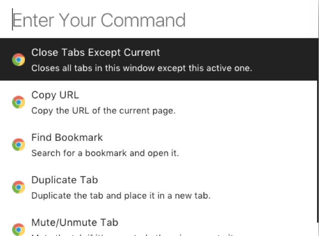
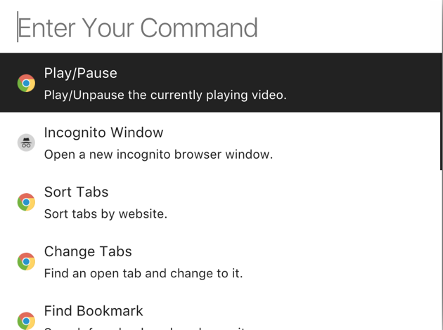
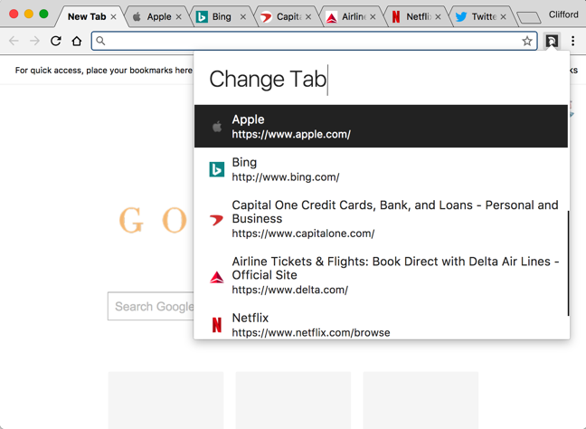
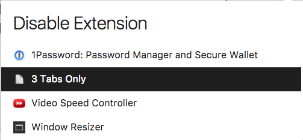
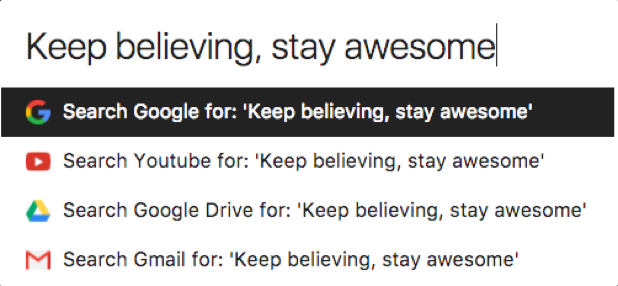
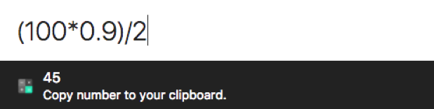
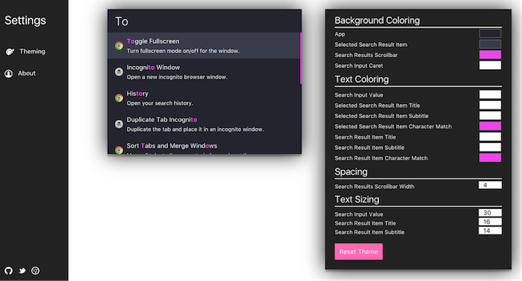

#  Cato

[![Chrome version][badge-cws]][link-cws]
[![PRs Welcome][prs-badge]][prs]
[![MIT License][license-badge]][LICENSE]
[![Tweet][twitter-badge]][twitter]

> Cato - a browser extension that allows you to control your browser with simple commands.
**Discuss it on [Product Hunt](https://www.producthunt.com/posts/cato)**🐈


## Install

- [**Chrome** extension](https://chrome.google.com/webstore/detail/cato/icphdcfpompgbdikholnedfeidemgobg)
- Opera - Use [this Opera extension](https://addons.opera.com/en/extensions/details/download-chrome-extension-9/) to install the Chrome version.


## Highlights

<table style="max-width: 700px;">
	<tr>
		<th colspan="2" style="text-align:center">
			Sample Commands
		</th>
	</tr>
	<tr><!-- Prevent zebra stripes --></tr>
	<tr>
		<td>
			
		</td>
		<td>
			
		</td>
	</tr>
</table>

<table style="max-width: 700px;">
	<tr><!-- Prevent zebra stripes --></tr>
  <tr>
		<td>
			
		</td>
		<td>
			
		</td>
	</tr>
</table>

<table style="max-width: 700px;">
	<tr>
		<th colspan="2" style="text-align:center">
			Fallback Searches and Calculator
		</th>
	</tr>
	<tr><!-- Prevent zebra stripes --></tr>
	<tr>
		<td>
			
		</td>
		<td>
			 </td>
	</tr>
</table>

<table style="max-width: 700px;">
	<tr>
		<th colspan="2" style="text-align:center">
			Customize your launcher
		</th>
	</tr>
	<tr><!-- Prevent zebra stripes --></tr>
	<tr>
		<td>
			
		</td>
</table>


### Changing this extension's shortcut keys

- By default to open Cato you can click the browser icon near your URL bar or you can use:
  - Mac: <kbd>Command ⌘</kbd> + <kbd>J</kbd>
  - Windows and Linux: <kbd>Ctrl</kbd> + <kbd>J</kbd>
- Alternatively, in Google Chrome, you can go to the URL `chrome://extensions` and scroll to the bottom and click **Keyboard shortcuts**


## Contribute

We're happy to receive suggestions and contributions.


## Development

To run the extension locally, you'll need to build it with:

```sh
# Build once
npm run build
```

```sh
# Build every time a file changes
npm run watch
```

Once built, load it in the browser.

### Chrome

1. Visit `chrome://extensions/` in Chrome
2. Enable the **Developer mode**
3. Click on **Load unpacked extension**
4. Select the folder `extension`


## Created by

- [Clifford Fajardo](https://github.com/cliffordfajard0)


## Story Behind Cato

One day, I forgot my laptop at home while visiting a cousin's house. Luckily, he had a backup chromebook laptop I could use temporarily. Of course using this pc wasn't the same as my own laptop which had Alfred App, my text editors and a few other command-driven apps.

I'd gotten accustomed to simply typing everything I needed on my computer, without almost ever using my mouse. I wanted a similar command-driven experience in one of the apps I use most as a software developer - my web browser. Thus, Cato was born.

Now, with Cato, I can get nearly the same command-driven experiences that apps like Alfred App/Atom/VSCode/Spotlight have, but in my web browser on nearly any operating system! #yay  🎉🍻🎊


[badge-cws]: https://img.shields.io/chrome-web-store/v/hlepfoohegkhhmjieoechaddaejaokhf.svg?label=chrome
[link-cws]: https://chrome.google.com/webstore/detail/cato/icphdcfpompgbdikholnedfeidemgobg "Version published on Chrome Web Store"

[license-badge]: https://img.shields.io/npm/l/cross-env.svg?style=flat-square
[license]: https://github.com/kentcdodds/cross-env/blob/master/other/LICENSE

[license-badge]: https://img.shields.io/npm/l/cross-env.svg?style=flat-square
[license]: https://github.com/kentcdodds/cross-env/blob/master/other/LICENSE

[prs]: http://makeapullrequest.com
[prs-badge]: https://img.shields.io/badge/PRs-welcome-brightgreen.svg?style=flat-square

[twitter]: https://twitter.com/intent/tweet?url=https%3A%2F%2Fchrome.google.com%2Fwebstore%2Fdetail%2Fcato%2Ficphdcfpompgbdikholnedfeidemgobg&via=cliffordfajard0&text=Checkout%20the%20command%20launcher%20browser%20extension%20-%20Cato%21
[twitter-badge]: https://img.shields.io/twitter/url/https/github.com/kentcdodds/cross-env.svg?style=social
